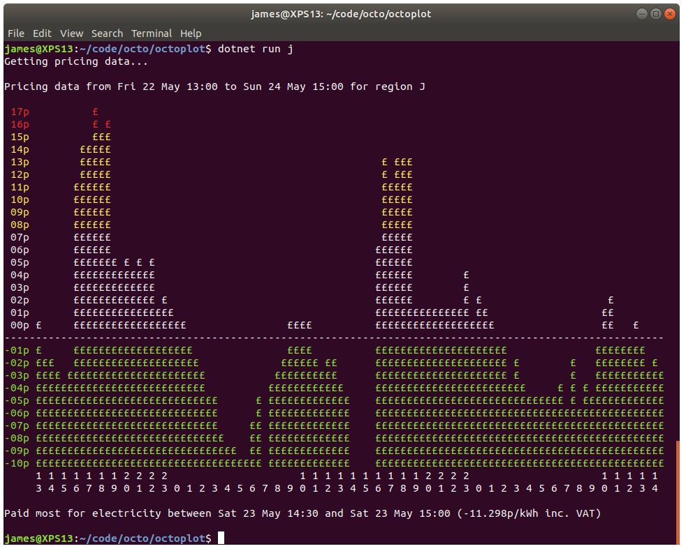

# OctoPlot

OctoPlot is a small command line tool that draws a graph of the [Octopus Energy Agile](https://octopus.energy/agile/) pricing in your terminal.

Agile Octopus is a 100% green electricity tariff that regularly _pays you_ to consume electricity.
Welcome to the future.

If you are not already living in the future then you can switch to Octopus Energy and get [£50 credit with this referral link](https://share.octopus.energy/storm-loris-49).

## Examples



<pre>Getting pricing data...

Pricing data from Fri 22 May 13:00 to Sun 24 May 15:00 for region P

<font color="#EF2929"> 18p                                                                                                     </font>
<font color="#EF2929"> 17p          £ £                                                                                        </font>
<font color="#EF2929"> 16p          £££                                                                                        </font>
<font color="#FCE94F"> 15p        £ £££                                                                                        </font>
<font color="#FCE94F"> 14p        £££££                                                                                        </font>
<font color="#FCE94F"> 13p        £££££                                           £ £££                                        </font>
<font color="#FCE94F"> 12p        £££££                                           £ £££                                        </font>
<font color="#FCE94F"> 11p       ££££££                                           £££££                                        </font>
<font color="#FCE94F"> 10p       ££££££                                           £££££                                        </font>
<font color="#FCE94F"> 09p       ££££££                                           £££££                                        </font>
<font color="#FCE94F"> 08p       ££££££                                           £££££                                        </font>
<font color="#EEEEEC"> 07p       ££££££                                           £££££                                        </font>
<font color="#EEEEEC"> 06p       £££££££                                         ££££££                                        </font>
<font color="#EEEEEC"> 05p       £££££££ £ £ £                                   ££££££                                        </font>
<font color="#EEEEEC"> 04p       £££££££££££££                                   ££££££        £                               </font>
<font color="#EEEEEC"> 03p       £££££££££££££                                   ££££££        £ £                             </font>
<font color="#EEEEEC"> 02p       £££££££££££££ £                                 ££££££        £ £                    £        </font>
<font color="#EEEEEC"> 01p       ££££££££££££££££                                £££££££££££££££££££                 ££        </font>
<font color="#EEEEEC"> 00p £     ££££££££££££££££££                ££££          £££££££££££££££££££                 ££   £    </font>
<font color="#EEEEEC">---------------------------------------------------------------------------------------------------------</font>
<font color="#8AE234">-01p £     £££££££££££££££££££               ££££          ££££££££££££££££££££                £££££££   </font>
<font color="#8AE234">-02p £££   ££££££££££££££££££££             £££££  £       £££££££££££££££££££££ £        £   ££££££££ £ </font>
<font color="#8AE234">-03p ££££ ££££££££££££££££££££££            £££££££££      £££££££££££££££££££££ £        £   £££££££££££</font>
<font color="#8AE234">-04p £££££££££££££££££££££££££££          ££££££££££££     £££££££££££££££££££££££      £ £ £ £££££££££££</font>
<font color="#8AE234">-05p £££££££££££££££££££££££££££        £ ££££££££££££     ££££££££££££££££££££££££££   £ £ £££££££££££££</font>
<font color="#8AE234">-06p £££££££££££££££££££££££££££££      £ £££££££££££££    ££££££££££££££££££££££££££££££££££££££££££££££</font>
<font color="#8AE234">-07p £££££££££££££££££££££££££££££     ££ £££££££££££££    ££££££££££££££££££££££££££££££££££££££££££££££</font>
<font color="#8AE234">-08p ££££££££££££££££££££££££££££££    ££ £££££££££££££    ££££££££££££££££££££££££££££££££££££££££££££££</font>
<font color="#8AE234">-09p ££££££££££££££££££££££££££££££    ££ £££££££££££££    ££££££££££££££££££££££££££££££££££££££££££££££</font>
<font color="#8AE234">-10p ££££££££££££££££££££££££££££££££ £££ £££££££££££££    ££££££££££££££££££££££££££££££££££££££££££££££</font>
<font color="#8AE234">-11p ££££££££££££££££££££££££££££££££££££ £££££££££££££    ££££££££££££££££££££££££££££££££££££££££££££££</font>
     1 1 1 1 1 1 1 2 2 2 2                     1 1 1 1 1 1 1 1 1 1 2 2 2 2                     1 1 1 1 1 
     3 4 5 6 7 8 9 0 1 2 3 0 1 2 3 4 5 6 7 8 9 0 1 2 3 4 5 6 7 8 9 0 1 2 3 0 1 2 3 4 5 6 7 8 9 0 1 2 3 4 

Paid most for electricity between Sat 23 May 14:30 and Sat 23 May 15:00 (-12.327p/kWh inc. VAT)

</pre>

## Use

Download a pre-built self-contained binary from the releases page and decompress it to a folder.
Change directory to the folder in a command prompt.

Run the app in your terminal specifying the [region ID character](https://en.wikipedia.org/wiki/Distribution_network_operator#History) for the area you are interested in.
E.g. `./octoplot j` for South East England.
The default value is `P` (North Scotland).

Add the folder to your `PATH` if you want to run `octoplot` from anywhere.

### Regions

These are the [region codes](api/Region.cs):

```c#
EastEngland = "A"
EastMidlands = "B"
London = "C"
NorthWales = "D"
WestMidlands = "E"
NorthEastEngland = "F"
NorthWestEngland = "G"
SouthEngland = "H"
SouthEastEngland = "J"
SouthWales = "K"
SouthWestEngland = "L"
Yorkshire = "M"
SouthScotland = "N"
NorthScotland = "P"
```

## Build

To build and run from source you will need the [.NET SDK](https://dotnet.microsoft.com/).

Clone the repo.

```bash
git clone git@github.com:jpsingleton/octoplot.git
```

Run the tool for the region you are in.

```bash
dotnet run j
```

## License

Licensed under the [EUPL-1.2-or-later](https://joinup.ec.europa.eu/collection/eupl/introduction-eupl-licence)
